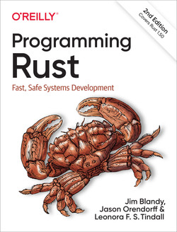
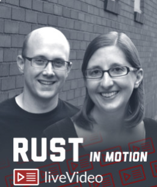

= Rust programming language learning resources
:toc:

== Books (printed, ebooks)

=== The Rust Programming Language (aka _The Book_)
https://doc.rust-lang.org/book/[_The Rust Programming Language_] (online), also as printed https://nostarch.com/Rust2018[_The Rust Programming Language_]  +
Steve Klabnik and Carol Nichols, with contributions from the Rust Community +
Released: Ongoing, with each new release of the Rust +
Publisher: (printed) No Starch Press +
Code: https://github.com/rust-lang/book/ +
Rust version used: latest (in online version), 2018 in printed book +
⭐⭐⭐

_Publisher description_: The Rust Programming Language is the official book on Rust: an open source systems programming language that helps you write faster, more reliable software. Rust offers control over low-level details (such as memory usage) in combination with high-level ergonomics, eliminating the hassle traditionally associated with low-level languages.

The authors of The Rust Programming Language, members of the Rust Core Team, share their knowledge and experience to show you how to take full advantage of Rust’s features—from installation to creating robust and scalable programs. 

=== Programming Rust, 2nd Edition
https://www.oreilly.com/library/view/programming-rust-2nd/9781492052586/[_Programming Rust, 2nd Edition_] 
Jim Blandy, Jason Orendorff, Leonora F.S. Tindall +
Released: June 2021 +
Publisher: O'Reilly Media, Inc. +
Code repo: https://github.com/ProgrammingRust +
Errata: https://www.oreilly.com/catalog/errata.csp?isbn=0636920258049 +
Rust version used: 1.50  +

_Publisher description_: Systems programming provides the foundation for the world's computation. Developing performance-sensitive code requires a programming language that puts programmers in control of how memory, processor time, and other system resources are used. The Rust systems programming language combines that control with a modern type system that catches broad classes of common mistakes, from memory management errors to interthread data races.

With this practical guide, experienced systems programmers will learn how to successfully bridge the gap between performance and safety using Rust. Jim Blandy, Jason Orendorff, and Leonora Tindall demonstrate how Rust's features put programmers in control over memory consumption and processor use by combining predictable performance with memory safety and trustworthy concurrency.

== Video (full courses, tutorials, conference talks)

=== Rust in Motion
https://www.manning.com/livevideo/rust-in-motion[_Rust in Motion_], Carol Nichols, Jake Goulding +
Released: November 2019 +
Publisher: Manning Publications +
Running time: 4h 7m +
Code repo: https://github.com/integer32llc/rust-in-motion-videos +
Rust version used: 1.24.1 

_Publisher description_: See it. Do it. Learn it! In Rust in Motion, premier Rust experts Carol Nichols and Jake Goulding, introduce you to the Rust programming language! Designed for modern systems programming, Rust delivers impressive speed and thread-safe concurrency. As coauthor of The Rust Programming Language, Carol literally helped write “The Book,” as the Rust community affectionately calls it. Jake created the Rust FFI Omnibus, and he’s also the #1 contributor to the Rust tag on Stack Overflow. If you’re ready to get started writing production-quality lightning-fast systems code, this liveVideo course is for you! 

